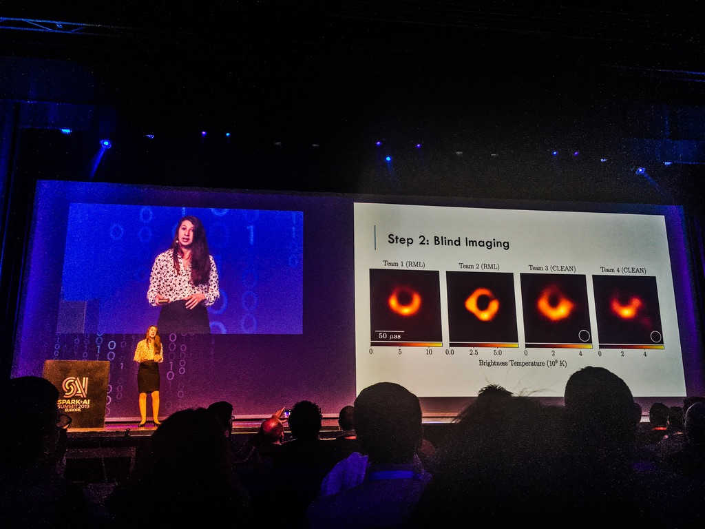

# Blackhole Image/Video Reconstruction

Keypoints are
- Inputs are not image pixels, but frequency domain data.
- Input data has time delays due to attenuation factors of the telescopes.
- Telescopes located on different geograhical locations have different bandwidth.
- Event Horizon telescope datasets are publicly available.

## Proof of concept (Team challenge)

- 4 core teams of researchers work independently to reconstruct image from frequency data with their algorithms.
- To avoid bias, no one had an idea what the ground truth looks like.
- Do a side-by-side comparison among all reconstruction results.
- Repeat the challenges with different ground truths.
- Identify the common characteristics of the reconstruction results among teams.

## Data Collection 

- Each telescope can only collect certain spot of frequency-domain data (like characteristic bandwidth).
- Each telescope pairs up with one another to verify the dimension.
- As Earth orbits, the reference of telescope changes and shifts the frequency-domain (bandwidth translation or something).
- Keep collecting data while Earth orbits fills the frequency-domain plane with shifted data.

## Frequency-Domain data to Image

- Original source was visible light range, sensed as frequency domain.
- Thus, do Fourier inverse transformation to convert it back to visible light range data.

## Account for folllowing measurement errors

- Amplitude errors
- Phase errors

## What did they discover

- Black hole image is not static. Generating images over time (days) signifying the rotation of the ring slightly clearly.
- Only the ring has highest level of certainty.
- The void background surrounding the rings have very poor level of certainty (due to noisy data).
- Knowing the size of the visible ring allows them calculating the size of the event horizon (Physicists invented the formulas a decade ago).

## Did they prove Einstein was right?

- No, they just failed to prove he was wrong. Still way to go.

