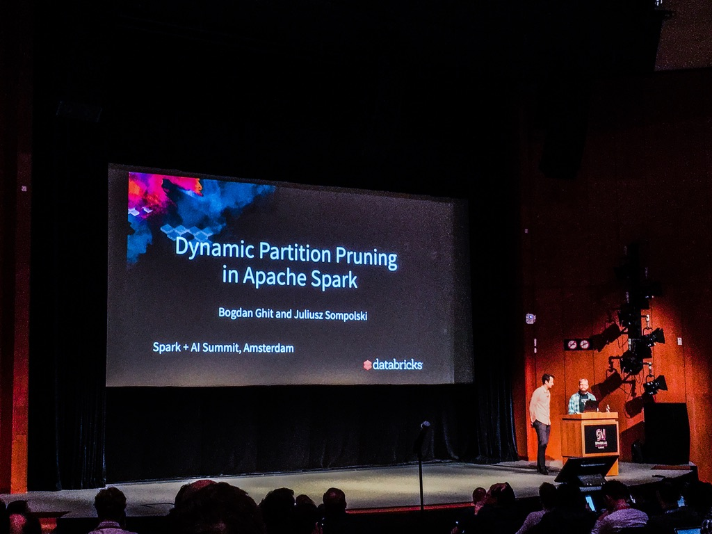

# Dynamic Partition Pruning

- Based on Spark 3.0
- Using 10 i3.xlarge machines on AWS
- Can speed up the data reading up to 100x
- Basic operations: Data -> Scan -> Filter
- *Static prunning*: To avoid scanning the full data, the operation is revered to: Data -> Filter -> Scan

## Use cases

- Joining a partitioned table with non-partitioned table with some join filter on non-partitioned.
- Classical approach, a subquery is created on the non-partitioned data before joining.
- If the table is small, spark broadcast and perform `HashJoin`.
- HashJoin means Spark creating a HashTable which maps join keys with rows (this already speeds up)
- Without broadcast hashjoin, DPP kicks in and help filtering