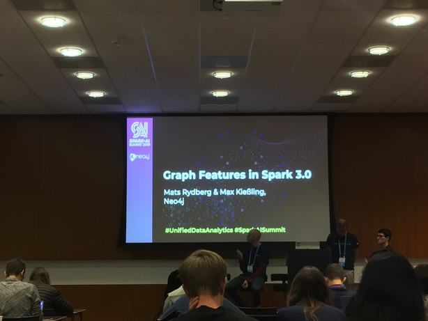

# Graph Features in Spark 3.0



Graph availabilty in other providers:
- Azure CosmosDB
- Amazon Neptune
- SQLServer 2017 (simple graph)
- GraphX in Spark (classical way of representing simple graph)

## Proposal
- [Spark-25994](https://issues.apache.org/jira/browse/SPARK-25994) : proposed to bring Cypher Query into Spark (originally developed by Neo4J)

## Cypher 
Is a query language for graph developed by Neo4J.

## Cypher Objects in Spark
- `SparkCypherSession`, created with `cypherSession = SparkCypherSession.create(spark)`
- Create a graph with `g = cypherSession.createGraph(nodeData, relationData)`
- Query with `g.cypher("QUERY SYNTAX")`

## Basic Graph Representation over Rows
- a Node is represented by a Row
- Edges (relationship) are represented by key-value pairs.
- Relationship always is strongly-typed.

## Property graph (`PropertyGraph`)
```
- Property Graph
  - Graph Type
  - Node Tables (DF, fixed schema, node can have `Label` represented by Label tables)
  - Relationship Tables (DF, fixed schema)
```

## Approaches of creating graph in Spark
- Using WideTables (one DF for nodes, one another for rel)
- Using NodeFrames and RelationshipFrames (***preferred***)


## CompleteGraphAPI Objects in Spark (2nd approach as above)
- `gframe = NodeDataSet.builder(df).idColumn(idColumn="???").labelSet(Array("")).properties(Map(...)).build()`
- `relframe = RelationshipDataset.builder(df).idColumn().sourceIdColumn().targetIdColumn().....build()`
- This needs one df for nodes, one df for labels, one df for relationships
- Graph object can be saved and loaded (not data, only graph plan)

## Cypher query

- Pattern matching (subgraph intersection based on pattern we are looking for)

Query uses matching instead of select like so:

```
MATCH pattern
WHERE pred
RETURN/WITH exp AS alias, ... <multiple columns go here, separate by comma>
ORDER BY exp
SKIP ... LIMIT ....
``` 

