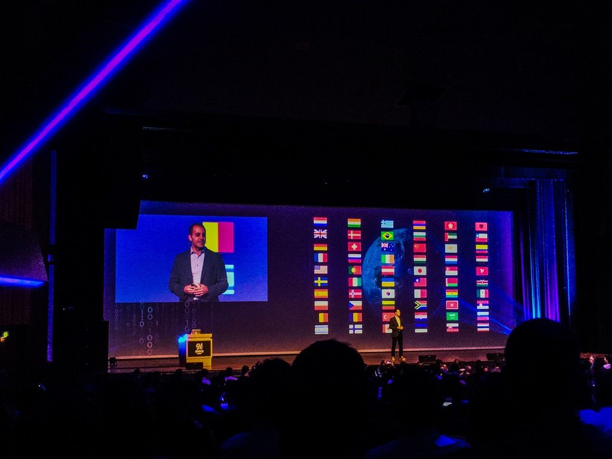
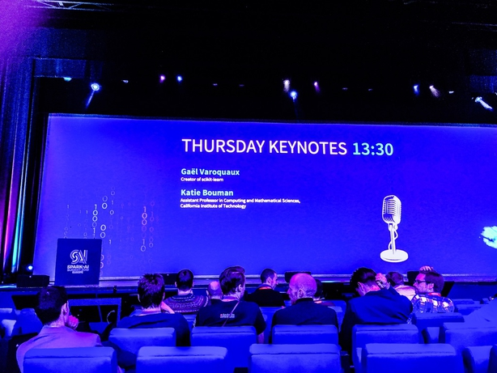
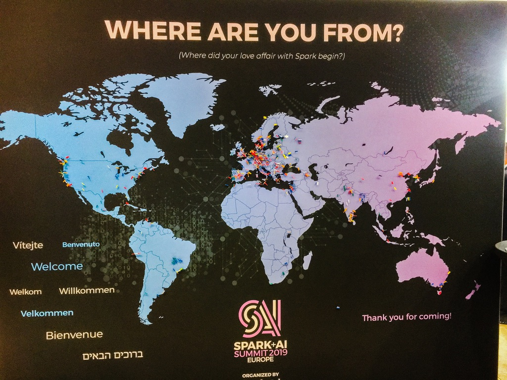
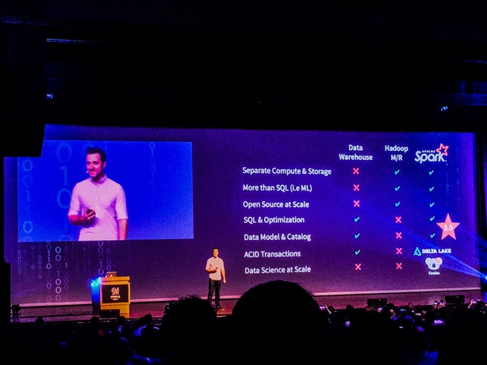

# Spark+AI Summit 2019, Amsterdam

Keynotes from big names of the industry

- Black hole image reconstruction **Katie Bouman, Caltech**
- Creator of Scikit **Gaël Varoquaux, RIA**

Notes from sessions I attended 

- Dynamic Partition pruning **Bogdan Ghit + Juliusz Sompolski, Databricks**
- Extend new data sources in Spark SQL **Jacek Laskowski**
- Feature factory **Daniel Tomes, Databricks**
- Graph features in Spark **Mats Rydberg + Max Kießling, Neo4J**
- Koalas **Tim Hunter + Takuya Ueshin, creators of Koalas, Databricks**
- Optimising Spark in practice **Daniel Tomes, Resident Solutions**
- Scaling Markov Decision Process **Justin Brandenburg, Databricks**
- Streaming **Ittai Yaffe, Nielsen**

