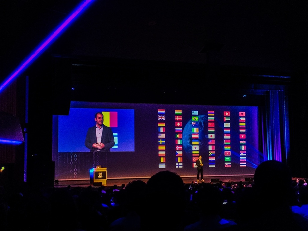

# Spark+AI Summit 2019, Amsterdam

Keynotes from big names of the industry

- [Black hole image reconstruction](Blackhole-Image-Reconstruction.md) **Katie Bouman, Caltech**
- [Creator of Scikit](Creator-of-Scikitlearn.md) **Gaël Varoquaux, RIA**

Notes from sessions I attended 

- [Dynamic Partition pruning](Dynamic-Partition-Pruning.md) **―― Bogdan Ghit + Juliusz Sompolski, Databricks**
- [Extend new data sources in Spark SQL](Extend-New-Datasources-Spark-SQL.md) **―― Jacek Laskowski**
- [Feature factory](Feature-Factory.md) **―― Daniel Tomes, Databricks**
- [Graph features in Spark3](Graph-Features-Spark3.md) **―― Mats Rydberg + Max Kießling, Neo4J**
- [Koalas, Spark with Pandas syntax](Koalas.md) **―― Tim Hunter + Takuya Ueshin, creators of Koalas, Databricks**
- [Optimising Spark in practice](Optimising-Spark-In-Practice.md) **――D aniel Tomes, Resident Solutions**
- [Scaling Markov Decision Process](Scaling-Markov-Decision-Process-For-Policy-Exploration.md) **―― Justin Brandenburg, Databricks**
- [Streaming](Stream.md) **―― Ittai Yaffe, Nielsen**

