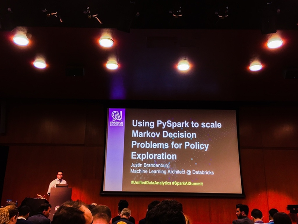

# Scaling Markov Decision Process (MDP) for Policy Exploration



Types of Complex system modeling:
- Agent-based
- Game Theory
- Discrete Event Simulation
- MDP

## Setup

- Using PySpark, on RDDs
- Run simulations, each is independent to one another
- Each RDD row is independent to others which can be achived with Spark natively
- Using Agents to explore observations based on policy trial
- Each row represents one agent
  - Run MDP simulation on each row (`flatMap`), potentially on each agent independently
  - So need to just write a function for MDP simulation (stateless)
  - Scaling only numbers of agents, not the observations

```python
# Each run, vary the simulation arguments
results = agent_rdd.flatMap(lambda r: run_mdp(r, arg1, arg2, policy, blah, blah))
```
